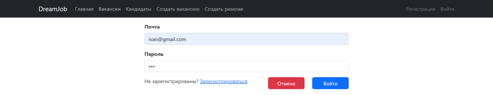
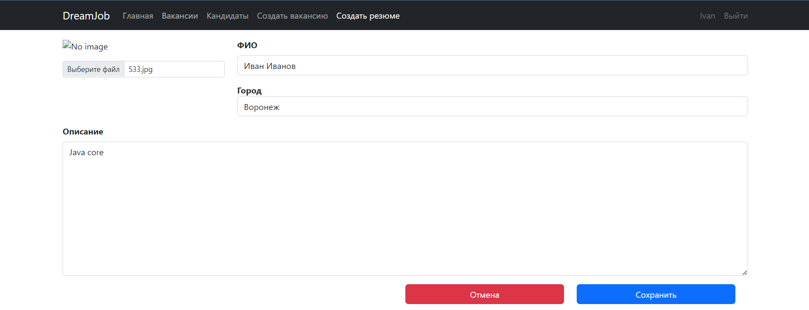
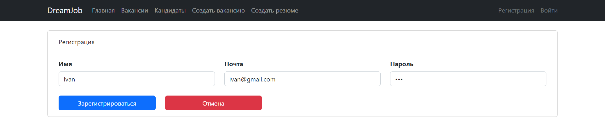
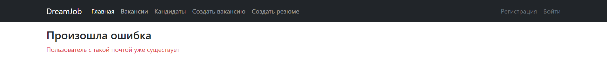
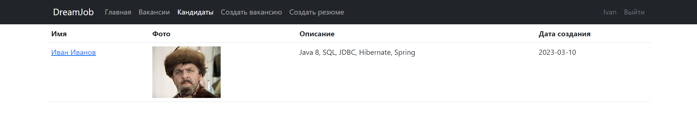
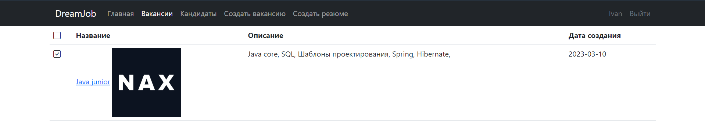
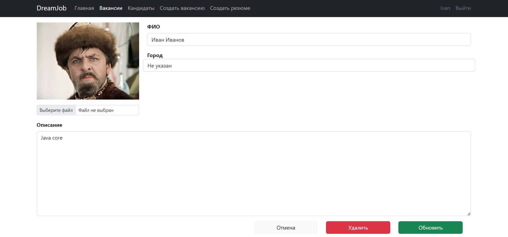
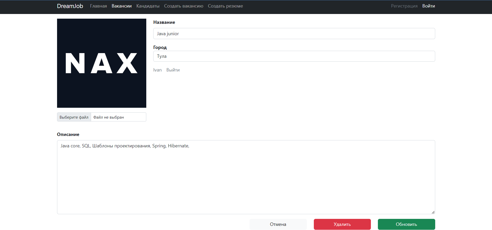

 ## Работа мечты
 В системе есть две модели:
 - вакансии,
 - кандидаты.

Можно публиковать как вакансии так и резюме кандидатов с описанием.

Общение с БД осуществляется по средстам JDBC использованием sql запросов.

### Стек технологий:


### Требования к окружению :

- 
- 
- 

### Запуск приложения

Запуск с помощью командной строки:

0. Создать БД:
```
CREATE DATABASE dreamjob;
```
1. Перейти в папку с проектом.
2. Выполнить команду: mvn liquibase:update -Pproduction
3. Выполнить команду: mvn clean install
4. Выполнить команду: mvn spring-boot:run
5. Перейти по ссылке: http://localhost:8080

### Окно входа


### Окно добавления вакансии


### Окно добавления кандидата


### Окно регистрации


### Окно регистрации повторной почты


### Окно кандидатов


### Окно вакансий


### Окно редактирования кандидата


### Окно редактирования вакансии


### Контакты: @WhiteVax